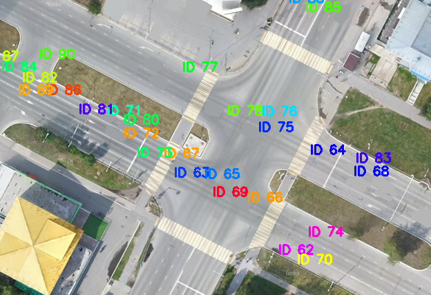

# Junior ML Contest

# Трекинг объектов и визуализация траекторий на 2D-карте с видеопотока CCTV

Проект реализует систему для детекции и трекинга движущихся объектов (например, автомобилей) на видеопотоке с камер наблюдения и отображения их траекторий на двумерной карте местности с помощью преобразования гомографии.

## 🔍 Основные возможности

- **Детекция объектов:** Используется модель `YOLOv11-OBB`, обученная для определения объектов с угловой ориентацией (oriented bounding boxes).
- **Мультиобъектный трекинг:** Интеграция трекера `ByteTrack` для устойчивого отслеживания объектов и сохранения ID даже при перекрытиях.
- **Преобразование координат:** Преобразование координат из изображения камеры в координаты на спутниковой карте с помощью матрицы гомографии.
- **Визуализация траекторий:** Отображение траекторий объектов на 2D-карте в реальном времени.

## 🛠 Используемые технологии

- Python, OpenCV, PyTorch
- YOLOv11-OBB (через `ultralytics`)
- ByteTrack
- FFmpeg, CVAT для аннотации данных

## 📍 Возможные применения

- Умное видеонаблюдение и анализ трафика
- Мониторинг перекрёстков и дорожной ситуации
- Поведенческий анализ в ритейле
- Визуализация потоков пешеходов и транспорта в общественных местах

## 📸 Пример визуализации

